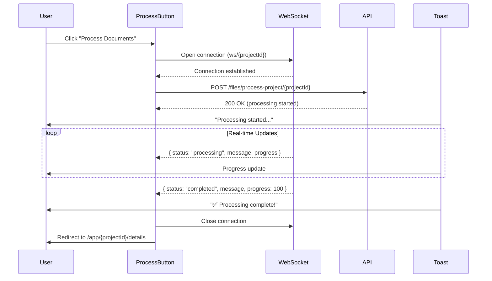

# Document Processing Phase Implementation Plan

## Overview

Implement real-time document processing with WebSocket updates, toast notifications, and automatic redirection to the details page upon completion.

---

## User Flow



---

## WebSocket Message Types

```typescript
interface ProcessingMessage {
	project_id: number;
	status: "processing" | "completed" | "error";
	message: string;
	progress: number; // 0-100
}
```

| Status       | Action                                   |
| ------------ | ---------------------------------------- |
| `processing` | Show progress toast, update UI           |
| `completed`  | Show success toast, close WS, redirect   |
| `error`      | Show error toast, close WS, enable retry |

---

## Folder Structure

```
src/
├── hooks/
│   └── useProcessingSocket.ts     # Custom WebSocket hook
├── components/app/project-files/
│   └── ProcessButton.tsx          # Updated with processing logic
└── lib/
    └── socket.ts                  # WebSocket utility functions
```

---

## File-by-File Implementation

### 1. `src/lib/socket.ts`

**Purpose**: WebSocket utility with reconnection logic

```typescript
export interface ProcessingMessage {
	project_id: number;
	status: "processing" | "completed" | "error";
	message: string;
	progress: number;
}

export function createProcessingSocket(projectId: number): WebSocket {
	const baseUrl = import.meta.env.VITE_API_BASE_URL?.replace(
		/^https?:\/\//,
		"",
	).replace(/\/$/, "");
	const protocol = import.meta.env.VITE_API_BASE_URL?.startsWith("https")
		? "wss"
		: "ws";
	const url = `${protocol}://${baseUrl}/ws/${projectId}`;
	return new WebSocket(url);
}

export function parseMessage(event: MessageEvent): ProcessingMessage | null {
	try {
		return JSON.parse(event.data) as ProcessingMessage;
	} catch {
		console.error("Failed to parse WebSocket message:", event.data);
		return null;
	}
}
```

---

### 2. `src/hooks/useProcessingSocket.ts`

**Purpose**: Custom React hook for WebSocket lifecycle management

```typescript
import { useCallback, useRef, useState } from "react";
import { useNavigate } from "@tanstack/react-router";
import { toast } from "sonner";
import {
	createProcessingSocket,
	parseMessage,
	type ProcessingMessage,
} from "@/lib/socket";
import { useProcessProjectFilesProcessProjectProjectIdPost } from "@/api/generated/files/files";

interface UseProcessingSocketOptions {
	projectId: number;
	maxRetries?: number;
}

interface UseProcessingSocketReturn {
	isProcessing: boolean;
	progress: number;
	startProcessing: () => void;
}

export function useProcessingSocket({
	projectId,
	maxRetries = 3,
}: UseProcessingSocketOptions): UseProcessingSocketReturn {
	const [isProcessing, setIsProcessing] = useState(false);
	const [progress, setProgress] = useState(0);
	const socketRef = useRef<WebSocket | null>(null);
	const retryCountRef = useRef(0);
	const navigate = useNavigate();

	const processProject = useProcessProjectFilesProcessProjectProjectIdPost();

	const cleanup = useCallback(() => {
		if (socketRef.current) {
			socketRef.current.close();
			socketRef.current = null;
		}
		setIsProcessing(false);
		setProgress(0);
		retryCountRef.current = 0;
	}, []);

	const handleMessage = useCallback(
		(event: MessageEvent) => {
			const message = parseMessage(event);
			if (!message) return;

			setProgress(message.progress);

			switch (message.status) {
				case "processing":
					// Show processing toast with progress
					toast.loading(message.message, {
						id: `process-${projectId}`,
						description: `Progress: ${message.progress}%`,
					});
					break;

				case "completed":
					toast.success("Processing Complete!", {
						id: `process-${projectId}`,
						description: message.message,
						duration: 5000,
					});
					cleanup();
					// Redirect to details page
					navigate({
						to: "/app/$projectId/details",
						params: { projectId: String(projectId) },
					});
					break;

				case "error":
					toast.error("Processing Failed", {
						id: `process-${projectId}`,
						description: message.message,
						duration: 8000,
					});
					cleanup();
					break;
			}
		},
		[projectId, navigate, cleanup],
	);

	const connectSocket = useCallback(() => {
		const socket = createProcessingSocket(projectId);
		socketRef.current = socket;

		socket.onopen = () => {
			retryCountRef.current = 0;
			toast.info("Connected to processing server", {
				id: `connect-${projectId}`,
				duration: 2000,
			});

			// Trigger the processing API after socket is connected
			processProject.mutate(
				{ projectId },
				{
					onSuccess: () => {
						toast.loading("Processing started...", {
							id: `process-${projectId}`,
							description: "Waiting for updates...",
						});
					},
					onError: (error) => {
						toast.error("Failed to start processing", {
							description: String(error),
						});
						cleanup();
					},
				},
			);
		};

		socket.onmessage = handleMessage;

		socket.onerror = () => {
			console.error("WebSocket error");
		};

		socket.onclose = (event) => {
			// Only retry if we haven't received completion and haven't exceeded retries
			if (isProcessing && retryCountRef.current < maxRetries) {
				retryCountRef.current += 1;
				toast.warning(
					`Connection lost. Retrying... (${retryCountRef.current}/${maxRetries})`,
					{
						id: `retry-${projectId}`,
						duration: 3000,
					},
				);
				setTimeout(() => connectSocket(), 2000);
			} else if (retryCountRef.current >= maxRetries) {
				toast.error("Connection failed after multiple attempts", {
					description: "Please try again later",
					duration: 8000,
				});
				cleanup();
			}
		};
	}, [
		projectId,
		handleMessage,
		isProcessing,
		maxRetries,
		processProject,
		cleanup,
	]);

	const startProcessing = useCallback(() => {
		if (isProcessing) return;
		setIsProcessing(true);
		setProgress(0);
		retryCountRef.current = 0;
		connectSocket();
	}, [isProcessing, connectSocket]);

	return {
		isProcessing,
		progress,
		startProcessing,
	};
}
```

---

### 3. Update `src/components/app/project-files/ProcessButton.tsx`

**Purpose**: Integrate WebSocket hook with button

```typescript
import { Button } from "@/components/ui/button";
import { Loader2, Play } from "lucide-react";
import { useProcessingSocket } from "@/hooks/useProcessingSocket";
import { useProjectFilesContext } from "./ProjectFiles";

export function ProcessButton() {
  const { projectId } = useProjectFilesContext();
  const { isProcessing, progress, startProcessing } = useProcessingSocket({
    projectId,
    maxRetries: 3,
  });

  return (
    <Button
      onClick={startProcessing}
      disabled={isProcessing}
      className="bg-gradient-to-r from-purple-600 to-pink-600 hover:from-purple-700 hover:to-pink-700 text-white font-bold">
      {isProcessing ? (
        <>
          <Loader2 className="w-4 h-4 mr-2 animate-spin" />
          Processing... {progress}%
        </>
      ) : (
        <>
          <Play className="w-4 h-4 mr-2" />
          Process Documents
        </>
      )}
    </Button>
  );
}
```

---

## Toast Notification Strategy

| Event              | Toast Type | Content                                     | Duration |
| ------------------ | ---------- | ------------------------------------------- | -------- |
| Socket connected   | `info`     | "Connected to processing server"            | 2s       |
| Processing started | `loading`  | "Processing started..."                     | Persists |
| Progress update    | `loading`  | File name + progress %                      | Updates  |
| Completed          | `success`  | "Processing Complete!" + summary            | 5s       |
| Error              | `error`    | "Processing Failed" + error message         | 8s       |
| Connection lost    | `warning`  | "Connection lost. Retrying..."              | 3s       |
| Retry failed       | `error`    | "Connection failed after multiple attempts" | 8s       |

---

## Environment Variables

Ensure `.env` has:

```
VITE_API_BASE_URL=https://your-backend-url.com/
```

The WebSocket URL is derived from this (replacing `https` → `wss`).

---

## Error Handling Strategy

1. **Socket Connection Failure**: Retry up to 3 times with 2s delay
2. **API Call Failure**: Show error toast, cleanup socket, re-enable button
3. **Processing Error from Server**: Show error toast with message, cleanup
4. **Unexpected Disconnection**: Attempt reconnection if still processing

---

## Cleanup Considerations

- Socket closes on:
    - `completed` message received
    - `error` message received
    - Retry limit exceeded
    - Component unmount (add `useEffect` cleanup)

---

## Checklist

- [ ] Create `src/lib/socket.ts` with WebSocket utilities
- [ ] Create `src/hooks/useProcessingSocket.ts` custom hook
- [ ] Update `ProcessButton.tsx` to use the hook
- [ ] Test connection with backend
- [ ] Verify redirect to details page works
- [ ] Handle edge cases (rapid clicks, navigation during processing)

---

## Future Considerations

1. **Persist Processing State**: If user navigates away and returns, show processing status
2. **Multiple Projects**: Ensure socket is project-specific and doesn't conflict
3. **Optimistic Updates**: Update TanStack Query cache after processing completes
4. **Progress Bar UI**: Consider adding a visual progress bar in addition to toasts
