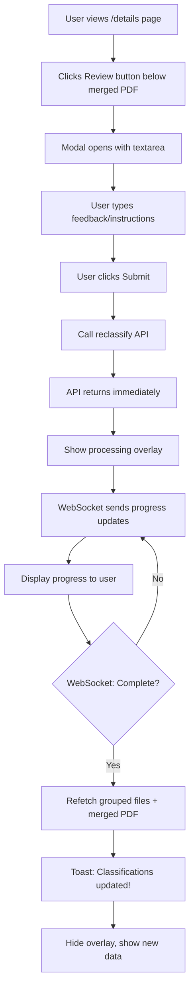

# Review Feedback Feature - Implementation Plan

## Overview

Add a "Review" button below the merged PDF viewer on the `/details` page. Users can provide natural language feedback to reclassify documents. The backend reprocesses via WebSocket with live progress updates.

---

## User Journey



---

## API & WebSocket Flow

### 1. Trigger Reclassification (HTTP)

```typescript
useReclassifyFilesFilesProjectsProjectIdReclassifyPost()

// Request
{
  projectId: number,
  data: {
    prompt: string,        // User's natural language feedback
    regenerate_pdf: true   // Always regenerate merged PDF
  }
}
```

### 2. Receive Progress Updates (WebSocket)

Use existing WebSocket connection (`useProcessingSocket`) to receive status updates:

- `processing` - Reclassification in progress
- `complete` - Done, refetch data
- `error` - Show error message

### 3. Data Refresh (after WebSocket complete)

Refetch:

1. `useGetProjectGroupedByCategoryFilesProjectsProjectIdGroupedByCategoryGet`
2. `useGetMergedPdfFilesProjectsProjectIdMergedPdfGet`

---

## Component Design

### ReviewFeedbackModal

```
┌──────────────────────────────────────────┐
│ 💬 Review Classifications                │
├──────────────────────────────────────────┤
│                                          │
│ Provide feedback to reclassify documents │
│                                          │
│ ┌──────────────────────────────────────┐ │
│ │ Move the bank statement to           │ │
│ │ Bankbescheinigungen category...      │ │
│ │                                      │ │
│ └──────────────────────────────────────┘ │
│                                          │
│         [Cancel]    [Submit Feedback]    │
└──────────────────────────────────────────┘
```

### Button Placement

```
┌─────────────────────────────────────────────────────┐
│ 📄 Merged Document                                  │
├─────────────────────────────────────────────────────┤
│                                                     │
│         [PDF Viewer with pagination]                │
│                                                     │
├─────────────────────────────────────────────────────┤
│         [Download Merged PDF]                       │
├─────────────────────────────────────────────────────┤
│         [💬 Review Classifications]  ◀── NEW       │
└─────────────────────────────────────────────────────┘
```

### Processing Overlay

Full-page overlay during reclassification:

- Spinner + "Reclassifying documents..."
- WebSocket progress messages displayed
- Blocks all user interaction

---

## Implementation Files

| File                       | Action | Description                                          |
| -------------------------- | ------ | ---------------------------------------------------- |
| `ReviewFeedbackModal.tsx`  | NEW    | Modal with feedback textarea                         |
| `MergedDocumentViewer.tsx` | MODIFY | Add Review button below download                     |
| `details.tsx`              | MODIFY | Add WebSocket listener, overlay state, refetch logic |
| `index.ts`                 | MODIFY | Export new modal component                           |

---

## State Flow

```typescript
// In details.tsx
const [isReclassifying, setIsReclassifying] = useState(false);
const [reclassifyStatus, setReclassifyStatus] = useState<string | null>(null);

// WebSocket hook for progress
useProcessingSocket({
	projectId,
	onMessage: (msg) => {
		if (msg.type === "reclassify_progress") {
			setReclassifyStatus(msg.status);
		}
		if (msg.type === "reclassify_complete") {
			refetchGroupedFiles();
			refetchMergedPdf();
			setIsReclassifying(false);
			toast.success("Classifications updated!");
		}
	},
});
```

---

## UX States

| State      | UI                                      |
| ---------- | --------------------------------------- |
| Idle       | Normal page, Review button visible      |
| Modal Open | Overlay with textarea                   |
| Submitting | Modal shows loader                      |
| Processing | Full-page overlay with WebSocket status |
| Complete   | Toast success, refreshed data           |
| Error      | Toast error, modal stays open           |

---

## Example Feedback Prompts

- "Move all bank documents to Bankbescheinigungen"
- "The contract.pdf should be in Arbeitsverträge"
- "Reclassify invoices that were incorrectly marked"
- "Mark bathroom-notice.pdf as Nicht Verwendbar"
